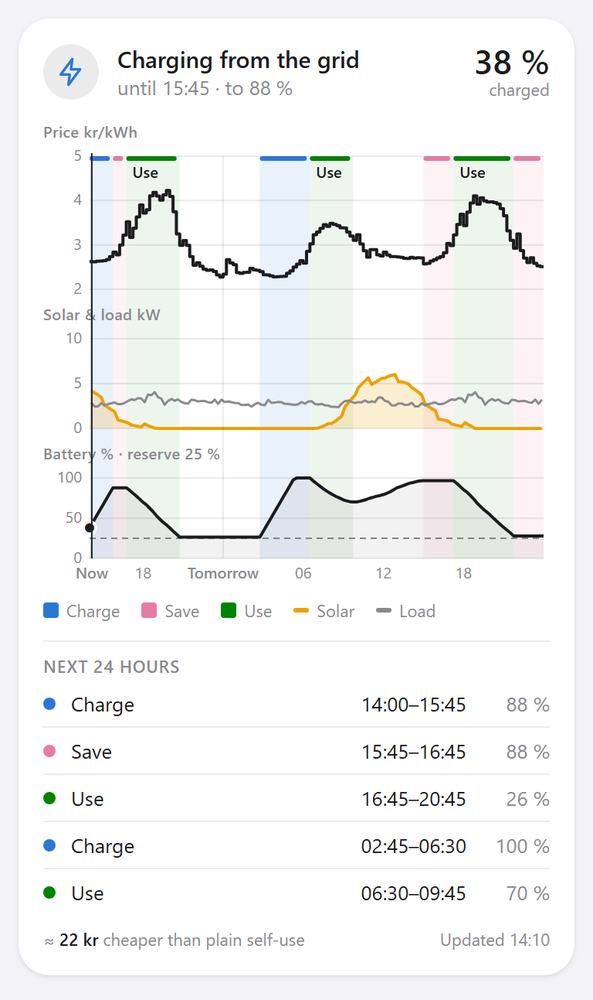
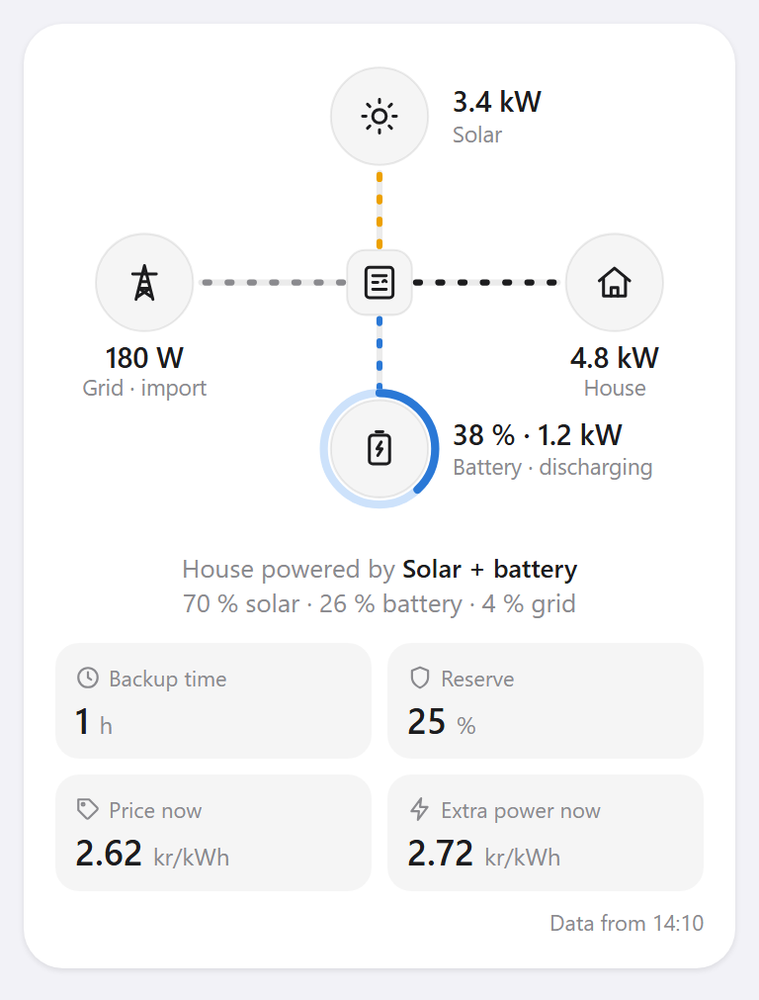
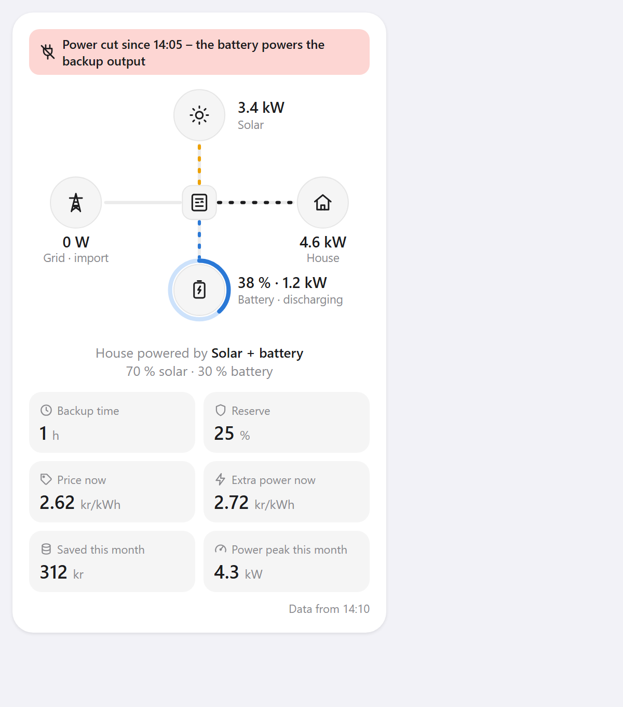

# Solis Smart Battery – user guide

Solis Smart Battery is a Homey Pro app for a Solis hybrid inverter with a battery. It:

- **plans the battery around electricity prices**: charges when power is cheap, saves the charge for
  expensive hours and lets the battery run the house when that pays off;
- **learns your house**: your real consumption pattern and how your solar panels actually perform;
- **keeps a reserve for power outages**, fills the battery before weather warnings and tells you
  when the power goes and how long the battery will last;
- **keeps power peaks down** when your grid company charges a power fee (effektavgift);
- **shows what the battery actually saves**, measured, and **checks that the inverter follows the plan**;
- **tells your flows what is going on**: what powers the house right now, whether there is solar to
  spare, and what one more kWh would cost.

Installing, updating and removing the app is described in [INSTALL.md](../INSTALL.md).
Which inverters it works with: [Supported inverters](#supported-inverters).

**Contents:**
[Supported inverters](#supported-inverters) ·
[Dashboard widgets](#dashboard-widgets) ·
[Dashboard in a browser](#dashboard-in-a-browser) ·
[Connection](#connection-soliscloud-or-modbus) ·
[The device](#the-device) ·
[Control modes](#control-modes) ·
[How the plan is made](#how-the-plan-is-made) ·
[Backup and power outages](#backup-and-power-outages) ·
[Power fee](#power-fee-effektavgift) ·
[Savings](#what-the-battery-saves) ·
[Plan check](#is-the-inverter-following-the-plan) ·
[Automations](#automations-flows) ·
[Settings](#settings) ·
[Troubleshooting](#troubleshooting) ·
[Where the data comes from](#where-the-data-comes-from)

---

## Supported inverters

The app talks to the inverter through SolisCloud and needs a Solis **hybrid** inverter (one with a
battery) whose firmware uses the **6-slot time-of-use schedule**. The app checks this when you add
the inverter and shows the result under the device's settings → **Inverter → App support**:

| App support | Meaning |
|---|---|
| **Supported** | The app plans and controls the battery. |
| **Monitor only** | A hybrid inverter whose firmware uses the older 3-slot schedule. The app shows prices, plans and live values, but cannot control the battery yet. Ask Solis support whether a firmware update is available. |
| **Not supported** | A string inverter without a battery. It is not offered when adding a device. |

Current S6 hybrids (S6-EH3P, S6-EH1P) have the 6-slot schedule. Whether older hybrids (RHI-5G,
S5-EH1P) have it depends on their firmware, which the check above shows. The app has been tested on
an **S6-EH3P20K-H**; other models use the same SolisCloud commands but are untested.

The data logger must allow control through SolisCloud: the **S2-WL-ST** (Wi-Fi stick) and
S3/S5-WiFi-ST work; DLS-W and DLS-L loggers do not.

---

## Dashboard widgets

The app has two widgets for Homey dashboards: **Battery plan** and **Battery status**. Both follow
Homey's light and dark mode and size themselves to their content. The pictures below are rendered
from the widget code with real prices and consumption from 23–24 September 2026.

### Adding the widgets to a dashboard

1. **Open a dashboard** in the Homey app (phone or [my.homey.app](https://my.homey.app)).
   The dashboard's name is shown at the top; tap the name (▾) to switch dashboards or create a new
   one, for example *Energy*.
2. **Tap the pencil** (top right) to edit the dashboard.
3. **Tap + Add Widget**, choose the **Apps** tab and then **Solis Smart Battery**.
4. **Pick a widget**: *Battery plan* or *Battery status*. Repeat for the other one.
5. For **Battery plan**, choose the widget settings:
   - *Time shown*: 24, 36 or 48 hours (default 36).
   - *Show solar and load forecast*: on or off (default on).
6. **Drag the widgets** into the order you want and **tap ✕** (top right) to stop editing.

To change a widget's settings later, edit the dashboard again and tap the widget. To remove it,
edit the dashboard and delete the widget; the app and its device are not affected.

**Tips**

- The two widgets work well together: *Battery status* for what happens right now, *Battery plan*
  for the coming day and a half.
- On the phone, touch and drag across the *Battery plan* charts to see the details of any
  quarter-hour.
- If a widget shows *Waiting for the first plan…*, the app has just started; the plan appears within
  a minute. *Add your Solis inverter* means the device has not been added yet (see
  [INSTALL.md](../INSTALL.md#5-add-the-inverter-in-homey)).

| Battery plan | Battery status |
|---|---|
|  |  |

Dark mode: [battery plan](images/battery-plan-dark.png), [battery status](images/battery-status-dark.png).

### Battery plan

Every part of the plan is named by what powers what. The same names are used in the chart, the
list and on the device tile:

| Name | What happens |
|---|---|
| **Grid charging** (blue) | The battery charges from the grid, because power is cheap now. |
| **Saving for later** (pink) | The battery keeps its charge for more expensive hours; the grid powers the house. |
| **Battery powers house** (green) | The battery covers the house instead of the grid. |
| **Solar charging** (yellow) | Solar surplus charges the battery. |
| **Solar powers house** (grey) | Solar just covers the house; the battery rests above the reserve. |
| **At reserve · grid powers house** (grey) | The battery is down to the reserve, kept for power outages; the grid powers the house. |
| **Full · solar powers house** (grey) | The battery is full; solar powers the house and the rest is sold. |

- **Top line**: what is happening now, until when, and to which battery level. When the weather
  turns out differently from the forecast in a self-use period (a sunny morning that was expected to
  be grey), the top line shows what really happens, marked *right now, differs from the forecast*.
  The device tile does the same: *Solar charging now · Grid charging 13:45–15:30*. The solar forecast
  for the next hours is also corrected by what the panels deliver now.
- **Notices** (when relevant): weather warning, preparing for an outage, battery locked by SolisCloud,
  or *Monitor only – the app is not controlling the inverter*.
- **Three charts on one time axis**, with the periods marked on top:
  - **Price per kWh** – what you pay per kWh, in the price area's currency (kr, €, zł).
  - **Solar & load kW** – expected solar production (yellow line) and house consumption (grey line).
  - **Battery %** – the expected battery level, the dot is the level now, the dashed line the reserve.
- **Touch and drag** across the charts (or use the arrow keys) to see price, period, solar, load and
  battery level for any quarter-hour.
- **Next 24 hours** lists the periods with the battery level each one ends at. Periods shorter than
  30 minutes where the battery just follows the house are merged into their neighbours.
- **Bottom line**: how much the plan saves compared with plain self-use, and when it was updated.

Widget settings: *Time shown* (24, 36 or 48 hours) and *Show solar and load forecast*.

### Battery status

- **Power flow**: solar, grid, house and battery around the inverter. The moving dots show the
  direction the power flows; the ring around the battery is its charge level. (With *reduce motion*
  switched on in your phone, the lines stand still.)
- **House powered by**: which sources run the house right now, with their shares.
- **Backup time**: how long the battery would last in a power outage at the current consumption.
- **Reserve**: the level kept for outages right now.
- **Price now**: what a kWh bought from the grid costs.
- **Extra power now**: what one *more* kWh costs right now – see
  [Automations](#automations-flows) for why this is the value to act on.
- **Saved this month**: what the battery has saved, measured – see [What the battery saves](#what-the-battery-saves).
- **Power peak this month** (with a power fee) or **Saved today** (without one). The peak tile gets a
  yellow edge while this hour's import is heading above the month's peak.
- **Notices** at the top: a red banner during a power cut, and yellow ones for weather warnings, a
  battery locked by SolisCloud, or an inverter that is not following the plan.

### Dashboard in a browser

Homey's web app cannot show widgets, so the app has its own dashboard page with both widgets. The
app has **no public or unauthenticated access**: every request needs your Homey login or a Homey
API key.

- **In the Homey web app**: open **Apps → Solis Smart Battery → Configure**. It uses your Homey
  login, like everything else in the Homey app.
- **On a wall screen, tablet or computer at home**: [`docs/dashboard/solis-dashboard.html`](dashboard/solis-dashboard.html)
  is one self-contained file that reads the values straight from Homey on your home network.
  Nothing goes through the internet, and no web server is needed.
  1. In the Homey web app, create an API key: **Settings → API Keys → New API Key** with only
     **Apps: control** (tested 25 Sep 2026: *Apps: read only* is not enough – Homey answers
     *Missing Scopes*). Such a key can also read and change other apps' settings, so keep it on
     devices you trust and remove it in Homey if a device is lost.
  2. Copy `solis-dashboard.html` to the device and open it in the browser (or put it on a local web
     server, e.g. a Raspberry Pi, if the device cannot open files).
  3. Enter Homey's address (e.g. `192.168.1.142`) and the key. They are stored in that browser only;
     **Forget the key on this device** removes the key and keeps the address for next time.
  4. From away, reach your home network through your own VPN (for example Tailscale) – never by
     opening a port.

  Add `#theme=dark` or `#theme=light` to the page address to fix the colours; otherwise it follows
  the device.

---

## Connection: SolisCloud or Modbus

The app reaches the inverter in one of two ways, chosen under **Connection** in the device settings:

| | SolisCloud | Modbus TCP |
|---|---|---|
| Needs | API key | the data logger's (or an RS485 gateway's) address on your network |
| Values | every 5 minutes | every minute (adjustable) |
| Works without internet | no | yes (the plan still needs prices) |
| History for learning | yes | from SolisCloud, if a key is also set |

Only **one connection is used at a time**. SolisCloud's commands and local Modbus both pass through
the inverter's data logger, and running both disturbs the logger (tested 25 Sep 2026: SolisCloud
commands timed out while Modbus was read every minute). With **Switch to the other connection if
this one fails** on, the app moves to the other connection after three failures in a row and tries
the chosen one again after 30 minutes. **Connection in use** under *Inverter* shows which one is
active.

A device can also be added with Modbus only: choose **Connect locally (Modbus)** on the first
pairing screen. How to find the logger and switch Modbus on: [LOCAL-MODBUS.md](LOCAL-MODBUS.md).

---

## The device

The inverter appears as one device in Homey, called **Home battery** (*Hembatteri* in Swedish);
rename it as you like. The inverter's model, rated power, firmware and what the app supports are in
the device's settings under **Inverter**.

The device has these values. The names are exactly as the app
shows them (English, or Swedish when Homey is set to Swedish). Numeric values and alarms can be
chosen as the device's tile indicator, and all numbers and alarms are kept in Homey Insights.

<!-- generated:capabilities -->
<!-- Generated by tools/gen-docs.mjs from the app manifest. Do not edit by hand. -->

| Value | In Swedish | Unit | What it means |
|---|---|---|---|
| **Battery** | Batteri | % | Battery state of charge. |
| **Battery power (+ charging, − discharging)** | Batteriets effekt (+ laddar, − laddar ur) | W | Battery power. Positive while charging, negative while discharging. Used by Homey Energy. |
| **Power source** | Elkälla |  | Which sources power the house right now: solar, battery and/or grid. A source counts when it delivers at least 100 W and 5 % of the consumption. Values: Solar, Solar + battery, Battery, Grid, Solar + grid, Battery + grid, Solar + battery + grid, Nothing (no load) |
| **Cost of extra power now** | Kostnad för extra el nu | kr/kWh | What one more kWh costs right now: the import price while buying from the grid, the export income you give up while selling solar, otherwise what the battery's energy is worth later (from the plan). The best value to base "run it now?" automations on. |
| **Control mode** | Styrläge |  | *Monitor only*: the app plans and shows, but never changes the inverter. *Automatic*: the app writes the charging schedule to the inverter. Values: Monitor only, Automatic |
| **Plan** | Plan |  | What happens now and the next battery periods, e.g. "Battery powers house until 21:00 · Grid charging 13:45–15:30". |
| **Electricity price now (buying)** | Elpris just nu (köp) | kr/kWh | What you pay per kWh bought right now, including fees, taxes and VAT. |
| **Solar production** | Solproduktion | W | Total solar panel production. |
| **House consumption** | Husets förbrukning | W | Total house consumption. |
| **Grid power (+ buying, − selling)** | Nätets effekt (+ köp, − försäljning) | W | Power to or from the grid. Positive while buying, negative while selling. |
| **Solar surplus** | Solöverskott | W | Solar production beyond the house consumption. It goes into the battery or to the grid. |
| **House power from solar** | Husets el från sol | % | Share of the house consumption covered by solar right now. |
| **House power from battery** | Husets el från batteri | % | Share of the house consumption covered by the battery right now. |
| **House power from grid** | Husets el från nätet | % | Share of the house consumption bought from the grid right now. |
| **Solar forecast today** | Solprognos idag | kWh | Expected solar production for the whole day, from the forecast calibrated against your panels. |
| **Backup reserve** | Reservnivå | % | Battery level kept for power outages right now (seasonal, raised during weather warnings). |
| **Backup time at current load** | Reservtid vid nuvarande förbrukning | h | How long the battery would last in a power outage at the current consumption, down to the inverter's outage limit. |
| **Power cut** | Strömavbrott |  | On while the inverter sees no grid voltage: the battery powers the backup output. |
| **Saved by the battery today** | Sparat med batteriet i dag | kr | What the battery saved today: the actual electricity cost compared with the same consumption and solar without a battery. Unit follows the price area’s currency. |
| **Saved by the battery this month** | Sparat med batteriet denna månad | kr | What the battery saved this month, including a lower power fee when that is switched on. |
| **Power peak this month** | Effekttopp denna månad | kW | Only with a power fee: the average of this month’s highest peaks so far, which the fee is based on. |
| **Power this hour (expected)** | Effekt denna timme (väntad) | kW | Only with a power fee: the average import this hour (or quarter) is heading for, weighted like the grid company does. |
| **Battery locked by SolisCloud** | Batteriet låst av SolisCloud |  | On when a leftover SolisCloud command keeps the battery at 0 A. See the troubleshooting section. |
| **Not following the plan** | Följer inte planen |  | On when the battery has not done what the plan says for 20 minutes, or no data has arrived for 20 minutes. The device’s warning line says what is wrong. |
| **Weather warning** | Vädervarning |  | On while a weather warning covers Homey's location. |
| **Weather warning** | Vädervarning |  | Text of the active weather warning(s). |
| **Energy charged** | Laddad energi | kWh | Total energy charged into the battery. Used by Homey Energy. |
| **Energy discharged** | Urladdad energi | kWh | Total energy discharged from the battery. Used by Homey Energy. |

<!-- /generated:capabilities -->

The battery also appears in **Homey Energy** as a home battery, with its charged and discharged energy.

---

## Control modes

The **Control mode** on the device decides whether the app is allowed to change the inverter.

- **Monitor only** (after installing): the app fetches prices, plans and shows everything, but never
  writes anything to the inverter.
- **Automatic**: the app writes the plan into the inverter's own time-of-use schedule every half hour
  when it changes. The inverter then runs the schedule by itself, even if Homey or the internet is
  down. The app also sets the inverter's reserve (backup) level.

Before choosing *Automatic*, switch off SolisCloud's own energy management (no strategy selected),
otherwise SolisCloud and the app overwrite each other.

The flow action **Hand control back to the inverter** removes the app's schedule from the inverter
and switches to *Monitor only*. Deleting the device while in *Automatic* does the same.

---

## How the plan is made

Every half hour the app makes a new plan for the rest of today and, after about 13:00, for tomorrow:

1. **Prices**: Nord Pool quarter-hour prices for your price area, turned into what you actually pay
   (supplier fees, energy tax, grid fee including the winter high-load time, VAT) and what you get
   for selling.
2. **Consumption**: your typical consumption per quarter-hour, learned separately for weekdays and
   weekends from the last 14 days and updated continuously.
3. **Solar**: a forecast for your panels, corrected by what they have actually produced. Periods
   where the inverter throttled the panels are left out of that learning.
4. **Optimisation**: for every quarter-hour the app chooses *charge*, *save* or *self-use* so the
   total cost is as low as possible, including battery losses, battery wear and a minimum gain before
   charging from the grid is worth it. The battery never sells to the grid.

The plan is turned into at most six charge periods for the next 24 hours, which is what the
inverter can hold. *Save* is a charge period at 0 A: the battery neither charges nor discharges.

---

## Backup and power outages

Two limits decide how much of the battery is available in a power outage:

- **Reserve** (app setting, 25 % April–October, 30 % November–March by default): in normal operation
  the battery is not used below this level.
- **Power-outage limit** (the inverter's *Off-Grid Overdischarge SOC*, set in SolisCloud): during an
  outage the battery can be used down to this level. 15 % is a good choice for LFP batteries.

During an outage the battery can be used from **whatever level it has** down to the outage limit.
The reserve only guarantees the minimum:

| Battery when the power goes | Usable during the outage (21.7 kWh battery, 15 % limit) |
|---|---|
| 95 % (morning after night charging) | about 17 kWh |
| 60 % (afternoon) | about 10 kWh |
| 25 % (worst case, reserve reached) | about 2 kWh |

**Weather warnings** (SMHI in Sweden, MET Norway in Norway): when a warning at the chosen level
covers Homey's location (or starts within the chosen number of hours), the app raises the reserve to the outage level (100 % by default) until the
warning ends. The flow action **Prepare for a power outage** does the same for a number of hours.
**Cancel manual battery overrides** stops it early.

### When the power goes

The app sees a power cut when the inverter reports no grid voltage. Then:

- the **Power cut** alarm switches on, the widget shows a red banner, and you get a notification in
  Homey's timeline: *Power cut at 14:05. Battery 78 % – about 9 h of backup at the current use*;
- in Automatic mode the app removes its charge and save periods from the inverter, so nothing holds
  the battery back while it powers the house;
- when less than 2 hours of backup are left, you get a second notification;
- when the power is back, a last notification says how long the cut lasted, and the plan is written
  to the inverter again.

If your house is moved to the backup output with a manual switch, the notification is your reminder
to switch. *Backup time* counts the energy down to the inverter's power-outage limit at the current
consumption, so it grows when you switch things off.

The flow cards **The power went out**, **Backup is running low during a power cut**, **The power came
back** and **There is a power cut** let you act on it, for example switch off the water heater and
the car charger during a cut. The notifications can be switched off under *Notifications* in the
settings.

> The grid-voltage signal is how Solis inverters report a missing grid. It has not been confirmed
> during a real power cut on this installation yet; the first cut will show whether the alarm comes
> as expected.

---

## Power fee (effektavgift)

Many grid companies charge a monthly fee per kW of your highest import peaks, and more Swedish grid
companies are introducing such fees. Switch it on under **Power fee** in the settings and copy the
terms from your grid company's price list:

| Setting | Example: Ellevio |
|---|---|
| Price per kW and month (incl. VAT) | from the price list |
| Number of peaks averaged | 3 |
| At most one peak per day | on |
| Peaks are measured per | hour |
| Counted from – until | 06:00 – 22:00 |
| Other hours count as | 50 % (night hours count half) |

With the fee switched on:

- the app measures the import each hour (or quarter-hour) like the grid company does, and keeps the
  month's highest peaks. When switched on, it reads this month's peaks from the SolisCloud history;
- the plan avoids new peaks: grid charging stays below the month's peak level, and the battery is
  saved for the hours where it keeps the peak down. Per kW, the fee costs far more than charging
  at a cheaper hour saves;
- **Power peak this month** shows the level the fee is based on, and **Power this hour (expected)**
  where the current hour is heading;
- the trigger **This hour's power is heading above the month's peak** and the condition with the
  same name let you hold back loads before a new peak is set:

> **When** This hour's power is heading above the month's peak
> **Then** pause the car charger for 20 minutes

---

## What the battery saves

The app measures, every five minutes, what your electricity actually costs, and compares it with what
the same consumption and solar production would have cost **without a battery**. The difference is
**Saved by the battery today** and **this month** (the month includes a lower power fee, when that is
switched on). Charging losses count against the battery, so the figure is what you really gain.

- Counting starts when the app is installed, and prices are those of your price source and settings.
- The *Battery plan* widget's *"cheaper than plain self-use"* is something else: the plan's expected
  gain over the next day compared with letting the inverter run on its own.
- The **Daily summary** trigger (and an optional notification) reports the saving just after midnight.

---

## Is the inverter following the plan?

In Automatic mode the app compares what the battery does with what the plan says. When a difference
lasts 20 minutes, the **Not following the plan** alarm switches on, the device's warning line says
what is wrong, and you get a notification:

| Message | Usual cause |
|---|---|
| Planned grid charging, but the battery is not charging | A limit in SolisCloud (grid charging switched off, max charge current), or the battery is warm or cold |
| Planned to save the battery, but it is discharging | The inverter did not take the save period, e.g. time-of-use switched off |
| The battery is above the reserve but not powering the house | A SolisCloud command holding the battery (see [Troubleshooting](#troubleshooting)) |
| The battery is charging from the grid without a plan | A SolisCloud energy-management strategy or the inverter's own force-charge level |
| The inverter settings were changed outside the app | Someone changed the schedule in SolisCloud; the app has written its own again |
| Export to the grid is switched off in the inverter | Switched off in SolisCloud (or left off by its energy management): surplus solar is thrown away |
| Export is limited to … W in the inverter | A low export limit in SolisCloud, often left behind by its energy management |
| Solar seems throttled | Production has followed the house load for 30 minutes while the forecast expected clearly more |
| No new data from the inverter since … | The data logger is offline (Wi-Fi, power) or SolisCloud is down |

The flow cards **The inverter stopped following the plan** (with the reason as a token) and **The
inverter follows the plan again** let you act on it. The export messages also show in *Monitor
only* mode, since they cost money whoever controls the battery.

---

## Negative export prices

When the export price (spot price plus your export compensation) is below zero, selling costs
money. With **Stop exporting when the export price is negative** on (the default) and the app in
*Automatic* mode, the app switches off export to the grid for those quarter-hours and switches it
back on afterwards. Surplus solar then goes to the house and the battery; when both are full, the
inverter holds the panels back. The widget shows *Export paused* meanwhile, and the plan counts that
surplus as worth nothing instead of a loss.

The app only switches export back on if it switched it off itself: if you turned export off in
SolisCloud, it stays off (and the plan check tells you so).

---

## Automations (Flows)

### Which value to act on

A common rule is *"if the house runs on battery power or electricity is cheap, then run the
dishwasher"*. The first half is misleading: battery power is not free. If the battery covers the
house during the evening peak, an extra load empties it sooner, and the last hours are then bought
at peak price.

**Extra power now** answers the real question – *what does one more kWh cost me right now?*

- while **buying** from the grid: the price you pay now;
- while **selling** solar: the income you give up (the export price);
- while the **battery** balances the house: what the battery's energy is worth later, according to
  the plan – typically what it costs to charge it again.

So the rule becomes one condition: **Extra power costs less than 2.00 kr/kWh now**.

### Example flows

**Run flexible loads when power is cheap**
> **When** The cost of extra power changed
> **And** Extra power costs less than *2.00* kr/kWh now
> **Then** turn on the water heater (or start the dishwasher)

**Use solar surplus**
> **When** What powers the house changed
> **And** Solar surplus is above *1500* W
> **Then** start charging the car

**Know what runs the house**
> **When** What powers the house changed
> **Then** send a notification: *House powered by [Powered by] – [From grid (%)] % from the grid*

**Power cut**
> **When** The power went out
> **Then** turn off the water heater and the car charger

**Weather warning**
> **When** A weather warning was issued for my location
> **Then** send a notification: *[Warning] in [Area] until [Until] – the battery is being filled*

**Locked battery**
> **When** The battery was locked by SolisCloud
> **Then** send a notification (see [Troubleshooting](#troubleshooting))

### Best time to run an appliance

Three flow cards answer *"when should the dishwasher run?"*. You give how long it runs, roughly how
much power it draws, and when it must be done:

- **It is the best time to run [120] min at [2] kW, done by [07:00]** (trigger): fires once, at the
  start of the cheapest window. Put the appliance's start in the *Then* part.
- **It is / is not the best time to run …** (condition), for flows that already run regularly.
- **Find the best time to run …** (action) gives the start and end time, the minutes until the start
  and the cost per kWh, for a notification or a timer.

The cost of each quarter-hour comes from the plan: solar that would otherwise be sold costs only the
export price, grid power the import price, and battery power what that energy is worth later. So
a sunny noon can beat a cheap night. If the time is too close for the run, the same time the next
day is used. Windows only reach as far as the known prices (tomorrow's arrive around 13:00).

> **When** It is the best time to run *150* min at *1.5* kW, done by *07:00*
> **Then** turn on the dishwasher's smart plug

### Prices from another service

If your prices come from elsewhere (for example your electricity company's Homey app), set
**Price source** to *From a flow* and send the prices with the action **Set electricity prices**:

> **When** a new price list is available (from your price app)
> **Then** Set electricity prices to *[the price list as JSON]*

The list holds one entry per hour or quarter-hour with a start time and the spot price per kWh
before fees, for example `[{"start":"2026-09-25T00:00:00+02:00","price":0.52}, …]`. The field names
used by common price services (`startsAt`, `total`, `time_start`, `SEK_per_kWh`) also work. The fees
in the *Electricity price* settings are added on top, so set them to 0 if the prices already include
everything. Send today's and tomorrow's prices; the plan updates right away.

### All flow cards

<!-- generated:flows -->
<!-- Generated by tools/gen-docs.mjs from the app manifest. Do not edit by hand. -->

**When… (triggers)**

| Card | Notes |
|---|---|
| What powers the house changed | Fires when the combination of solar, battery and grid that runs the house changes. Tokens: Powered by, From solar (%), From battery (%), From grid (%) |
| The cost of extra power changed | Fires when the cost of using one more kWh changes by at least 0.10 (in your currency). Tokens: Cost per kWh |
| The battery plan was updated | Fires every time a new plan is made (about every 30 minutes). Tokens: Summary, Expected savings |
| The planned battery action changed | Fires when the plan switches between grid charging, saving for later and self-use. Action is charge, hold or self_use. Tokens: Action |
| A weather warning was issued for my location | Fires once per new warning at the chosen level that covers Homey's location. Tokens: Level, Warning, Area, Until |
| The weather warnings for my location ended | Fires when no warning at the chosen level covers Homey's location any more. |
| The battery was locked by SolisCloud | A leftover SolisCloud remote command holds the battery at 0 A. Release it with Quick Control → Discharge with a duration in SolisCloud. |
| The battery was released | Fires when the SolisCloud limit is back to normal and the battery works again. |
| The power went out | The inverter sees no grid voltage. The battery now powers what is connected to its backup output. Tokens: Battery (%), Backup time (h) |
| The power came back | Tokens: Power cut length (min), Battery (%) |
| Backup is running low during a power cut | Less than 2 hours of backup left at the current use. Tokens: Battery (%), Backup time (h) |
| The inverter stopped following the plan | The battery has not done what the plan says for 20 minutes, the inverter settings were changed outside the app, or no data has arrived for 20 minutes. Tokens: Reason |
| The inverter follows the plan again |  |
| This hour's power is heading above the month's peak | Fires once per period when the expected average import would raise this month's power fee. Switch something off to avoid it. Tokens: Expected (kW), Month's peak level (kW) |
| Daily summary | Fires just after midnight with what the battery saved the day before. Tokens: Saved yesterday, Saved this month, Power peak this month (kW) |
| It is the best time to run *[minutes]* min at *[power]* kW, done by *[deadline]* | Finds the start (on a quarter-hour) where running for that long at that power costs least and is done by the given time, using the plan: solar that would be sold costs the export price, grid power the import price, and battery power what it is worth later. If the time is too close, the same time tomorrow is used. Tokens: Done at, Cost per kWh |

**And… (conditions)**

| Card | Notes |
|---|---|
| The house is / is not using power from *[source]* | True when the source delivers at least 100 W and 5 % of the house consumption. |
| Solar surplus is / is not above *[watts]* W | Surplus = solar production minus house consumption; it goes into the battery or to the grid. |
| Extra power costs / does not cost less than *[price]* per kWh now | What one more kWh costs right now: the import price when buying, the lost export income when selling solar, otherwise what the battery's energy is worth later. |
| Planned action is / is not *[action]* | What the plan does in the current quarter-hour. In self-use the battery powers the house when needed, stores solar surplus, and stops at the reserve. |
| Price is / is not among the *[hours]* cheapest hours today | Compares the current import price with today's quarter-hour prices. |
| A weather warning is / is not active | True while a weather warning at the chosen level covers Homey's location. |
| There is / is not a power cut |  |
| This hour's power is / is not heading above the month's peak | Use it to hold back loads such as car charging or water heating while it is true. |
| It is / is not the best time to run *[minutes]* min at *[power]* kW, done by *[deadline]* | Finds the start (on a quarter-hour) where running for that long at that power costs least and is done by the given time, using the plan: solar that would be sold costs the export price, grid power the import price, and battery power what it is worth later. If the time is too close, the same time tomorrow is used. |

**Then… (actions)**

| Card | Notes |
|---|---|
| Set control mode to *[mode]* | Monitor only never changes the inverter. Automatic writes the plan to the inverter. |
| Charge from grid for *[minutes]* minutes | Overrides the plan: charges from the grid for the given time, then the plan takes over again. |
| Save the battery charge for *[minutes]* minutes | Overrides the plan: the battery neither charges nor discharges for the given time. |
| Prepare for a power outage during *[hours]* hours | Raises the reserve to the outage level (setting) for the given time, so the battery is filled. |
| Cancel manual battery overrides | Ends manual charge/save overrides and outage preparation, including preparation for the current weather warning. |
| Update the battery plan now | Fetches prices and forecasts and makes a new plan right away (normally every 30 minutes). |
| Set electricity prices to *[prices]* | Only used when the price source is 'From a flow'. A JSON list of spot prices per kWh before fees, one entry per hour or quarter: start time and price. Also accepts 'startsAt', 'time_start' and 'total', 'value' or 'SEK_per_kWh'. Send today's and tomorrow's prices; later entries replace earlier ones. |
| Hand control back to the inverter | Removes the app's schedule from the inverter and switches to Monitor only. |
| Find the best time to run *[minutes]* min at *[power]* kW, done by *[deadline]* | Finds the start (on a quarter-hour) where running for that long at that power costs least and is done by the given time, using the plan: solar that would be sold costs the export price, grid power the import price, and battery power what it is worth later. If the time is too close, the same time tomorrow is used. |

<!-- /generated:flows -->

---

## Settings

Open the device and tap the gear icon.

<!-- generated:settings -->
<!-- Generated by tools/gen-docs.mjs from the app manifest. Do not edit by hand. -->

**Connection**

| Setting | Default | What it does |
|---|---|---|
| Connect through | SolisCloud (internet) | Only one connection is used at a time: SolisCloud commands and local Modbus both go through the inverter's data logger and disturb each other. Modbus gives values every minute and works without internet. |
| Switch to the other connection if this one fails | on | After three failures in a row. The app tries the chosen connection again after 30 minutes. Needs both to be set up. |
| Key ID | (from pairing) | SolisCloud API key. Leave empty if you only use Modbus. |
| Key secret | (from pairing) |  |
| Modbus address | (from pairing) | IP address of the data logger (S2-WL-ST) or RS485 gateway, e.g. 192.168.1.97. Reserve it in the router so it does not change. |
| Modbus port | 502 |  |
| Modbus unit id | 1 |  |
| Modbus update interval | 60 s | How often values are read over Modbus. SolisCloud updates every 5 minutes. |

**Backup reserve**

| Setting | Default | What it does |
|---|---|---|
| Reserve April–October | 25 % | Kept for power outages in normal operation. Must be above the inverter's power-outage limit (Off-Grid Overdischarge SOC, set to 15 % here); only the part above that limit is usable during an outage. |
| Reserve November–March | 30 % |  |
| Charge level when preparing for an outage | 100 % |  |

**Solar forecast**

| Setting | Default | What it does |
|---|---|---|
| Use solar forecast in the plan | on | Calibrated against your measured production, so errors in size or orientation shrink over time. |
| Forecast source | Open-Meteo (free, no account) | Open-Meteo: 15-minute irradiance and 14 days of history for a quick calibration. Forecast.Solar: hourly production estimate. Solcast: forecast for the rooftop sites set up in your Solcast account; uses the API key and site IDs below. |
| API key (Solcast, or Forecast.Solar paid plan) | (from pairing) |  |
| Solcast site IDs | (from pairing) | Resource IDs of your rooftop sites, separated by commas. Solcast allows 10 requests a day, so the app fetches at most every 2.5 hours per site. |
| Array 1 size | 11 kWp | Also used with Solcast, to judge when production is high enough to learn from. |
| Array 1 tilt | 35 ° | 0° = flat, 90° = vertical |
| Array 1 facing | South | The direction the panels face, in 15° steps. |
| Array 2 size (0 = none) | 0 kWp |  |
| Array 2 tilt | 35 ° |  |
| Array 2 facing | East |  |
| Forecast trust | 80 % | Share of the forecast the plan counts on. Lower = more grid charging before uncertain days. |

**Weather warnings**

| Setting | Default | What it does |
|---|---|---|
| Prepare for outages on weather warnings | on | Charges to the outage level while a warning covers Homey's location. |
| Warning service | SMHI (Sweden) | The national weather service for Homey's location. |
| Lowest warning level | Yellow |  |
| Weather warnings only (not water levels, fire risk) | on |  |
| Start preparing ahead of a warning | 12 h |  |

**Battery**

| Setting | Default | What it does |
|---|---|---|
| Capacity | 21.68 kWh |  |
| Grid charge power | 6.5 kW | Limited by the inverter's max charge current (16 A ≈ 6.7 kW at 420 V). |
| Max discharge power | 10 kW |  |
| Max charge level | 100 % |  |
| Round-trip efficiency | 90 % |  |
| Battery wear cost | 0.2 SEK/kWh | Cost per kWh discharged. Qapasity Arctic: 10 years / 8000 cycles; about 240 cycles per year makes age the limit, so wear per cycle is low. |
| Minimum gain for grid charging | 0.1 SEK/kWh |  |

**Electricity price**

| Setting | Default | What it does |
|---|---|---|
| Price source | elprisetjustnu.se (Sweden) | Day-ahead spot prices; tomorrow's arrive around 13:00 CET. 'From a flow' uses prices sent with the 'Set electricity prices' action card, e.g. from another price app. |
| Price area | SE3 Stockholm | elprisetjustnu.se covers SE1–SE4 only. The currency follows the area (SEK, NOK, DKK, PLN or EUR). |
| VAT | 25 % |  |
| Supplier fees (ex VAT) | 0.1223 per kWh | Variable costs and markups on top of spot. |
| Energy tax (ex VAT) | 0.36 per kWh |  |
| Grid transfer fee (ex VAT) | 0.244 per kWh |  |
| Grid fee has a high-load time | on | A higher transfer fee at certain hours, e.g. Vattenfall's time tariff: November–March, weekdays 06–22, not on public holidays. |
| Grid transfer fee high-load time (ex VAT) | 0.612 per kWh | Vattenfall Tidstariff 2026: 0.612 (76.5 öre incl. VAT). The fee outside high-load time is 0.244 (30.5 öre incl. VAT). |
| High-load time from | 06:00 |  |
| High-load time until | 22:00 |  |
| High-load time on weekdays only | on |  |
| High-load time November–March only | on |  |
| Public holidays count as other time | on | New Year's Day, Epiphany, Good Friday, Easter Monday, Christmas Eve, Christmas Day, Boxing Day and New Year's Eve. |
| Export compensation on top of spot | 0.104 per kWh |  |
| Stop exporting when the export price is negative | on | In Automatic mode the app switches off export to the grid while selling would cost money, and switches it back on afterwards. Surplus solar is then used in the house and battery, or the panels are throttled. |

**Power fee (effektavgift)**

| Setting | Default | What it does |
|---|---|---|
| My grid fee includes a power fee | off | The grid company charges per kW of the month's highest import peaks. The plan then avoids new peaks, and grid charging stays below the month's peak level. |
| Price per kW and month (incl. VAT) | 0 per kW |  |
| Number of peaks averaged | 3 |  |
| At most one peak per day | on |  |
| Peaks are measured per | Hour |  |
| Counted from | 00:00 |  |
| Counted until | 24:00 |  |
| Other hours count as | 0 % | 0 % = not counted, 50 % = half (e.g. Ellevio's night hours 22–06). |
| Weekdays only | off |  |
| November–March only | off |  |

**Planning**

| Setting | Default | What it does |
|---|---|---|
| Average house load | 2 kW | Used until a load profile is learned from history. |

**Notifications**

| Setting | Default | What it does |
|---|---|---|
| Power cuts | on | A timeline notification when the power goes, when backup runs low (under 2 h) and when the power is back. |
| Inverter not following the plan | on |  |
| Daily summary | off | After midnight: what the battery saved yesterday and so far this month. |

**Inverter**

| Setting | Default | What it does |
|---|---|---|
| Model | – |  |
| Rated power | – |  |
| Firmware | – |  |
| App support | – |  |
| Connection in use | – |  |

<!-- /generated:settings -->

---

## Troubleshooting

**"Battery locked by SolisCloud"**: SolisCloud's energy management and its *Quick Control* steer the
battery with a remote current limit. If such a command is left behind at 0 A, the battery neither
charges nor discharges and no inverter setting can override it. To release it:

1. In SolisCloud, make sure no energy management strategy is selected.
2. Open **Quick Control → Discharge**: about 2 kW, target SOC above your reserve, **Export on**,
   duration 1 hour, and start it.
3. When the hour is over, the limit returns to normal and the battery works again.

More problems and solutions (installation, API key, datalogger): see [INSTALL.md](../INSTALL.md#troubleshooting).

---

## Where the data comes from

| Data | Source |
|---|---|
| Inverter values and settings | SolisCloud API with your own API key |
| Electricity prices | Your choice: Nord Pool day-ahead prices via elprisetjustnu.se (Sweden) or Nord Pool's data portal (Nordics, Baltics, Germany, the Netherlands, Belgium, France, Austria, Poland), or prices sent from a flow |
| Solar forecast | Your choice: Open-Meteo, Forecast.Solar or Solcast, for Homey's location |
| Power peaks, savings, power cuts | Measured by the app from the inverter's values |
| Weather warnings | Your choice: SMHI (Sweden) or MET Norway (Norway) |

The app sends nothing else anywhere. Your API key is stored in the device settings on your Homey.
